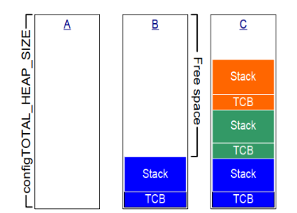
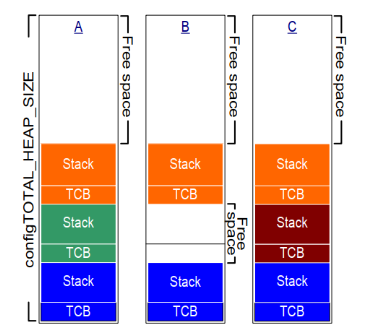

# STM32 FreeRTOS 10_内存管理

内核对象一般都是动态分配：用到时分配，不使用时释放。使用内存的动态管理功能，简化了程序设计：不再需要小心翼翼地提前规划各类对象，简化API函数的涉及，甚至可以减少内存的使用。

## 1. 内存相关基本概念

- 堆栈的概念：

  堆(heap)，就是一块空闲的内存，需要提供管理函数。

  - `malloc`：从堆里划出一块空间给程序使用；
  - `free`：用完后，再把它标记为空闲的，可以再次使用；

  栈(stack)，函数调用时局部变量保存在栈中，当前程序的环境也是保存在栈中。可以从堆中分配一块空间用作栈。

## 2. FreeRTOS 的内存管理

FreeRTOS中内存管理的接口函数为：`pvPortMalloc` 、`vPortFree`，对应于C库的`malloc`、`free`函数。

源码中默认提供了5个文件，对应内存管理的5种方法。

|文件	|优点|	缺点|
|-|-|-|
|`heap_1.c`|	分配简单，时间确定	|只分配、不回收|
|`heap_2.c`|	动态分配、最佳匹配	|碎片、时间不定|
|`heap_3.c`|	调用标准库函数|	速度慢、时间不定|
|`heap_4.c`|	相邻空闲内存可合并	|可解决碎片问题、时间不定|
|`heap_5.c`|	在heap_4基础上支持分隔的内存块	|可解决碎片问题、时间不定|

### Heap_1

只实现了`pvPortMalloc`，没有实现`vPortFree`。如果程序不需要删除内核对象，那么可以使用`heap_1`。

> - 实现最简单；
> - 没有碎片问题；
> - 一些要求非常严格的系统里，不允许使用动态内存。

Heap_1 定义一个大数组，对于`pvPortMalloc`调用时，从这个数组中分配空间。



### Heap_2

Heap_2也是在数组上分配内存，跟Heap_1不一样的地方在于：

> - Heap_2使用最佳匹配算法来分配内存（找出最小的、能满足`pvPortMalloc`的内存）；
> - 支持`vPortFree`；

Heap_2不会合并相邻的空闲内存，所以Heap_2会导致严重的碎片化问题。

如果申请、分配内存时大小总是相同的，这类场景下Heap_2没有碎片化的问题。所以它适合这种场景：频繁地创建、删除任务，但是任务的栈大小都是相同的(创建任务时，需要分配TCB和栈，TCB总是一样的)。



### Heap_3

Heap_3使用标准C库里的`malloc`、`free`函数，所以堆大小由链接器的配置决定，配置项`configTOTAL_HEAP_SIZE`不再起作用。

C库里的`malloc`、`free`函数并非线程安全的，Heap_3中先暂停FreeRTOS的调度器，再去调用这些函数，使用这种方法实现了线程安全。

### Heap_4

Heap_4也是使用大数组来分配内存。

> - Heap_4使用首次适应算法来分配内存；
> - 把相邻的空闲内存合并为一个更大的空闲内存，这有助于较少内存的碎片问题。

Heap_4会把相邻空闲内存合并为一个大的空闲内存，可以较少内存的碎片化问题。适用于这种场景：频繁地分配、释放不同大小的内存。

### Heap_5

Heap_5分配内存、释放内存的算法跟Heap_4是一样的。相比于Heap_4，Heap_5并不局限于管理一个大数组：它可以管理多块、分隔开的内存。在嵌入式系统中，内存的地址可能并不连续，这种场景下可以使用Heap_5。

在使用`pvPortMalloc`之前，必须先指定内存块的信息，使用`vPortDefineHeapRegions`来指定这些信息。

```c
typedef struct HeapRegion
{
    uint8_t * pucStartAddress; // 起始地址
    size_t xSizeInBytes;       // 大小
} HeapRegion_t;

HeapRegion_t xHeapRegions[] =
{
  { ( uint8_t * ) 0x80000000UL, 0x10000 }, // 起始地址0x80000000，大小0x10000
  { ( uint8_t * ) 0x90000000UL, 0xa0000 }, // 起始地址0x90000000，大小0xa0000
  { NULL, 0 } // 表示数组结束
 };

void vPortDefineHeapRegions( const HeapRegion_t * const pxHeapRegions );
```

