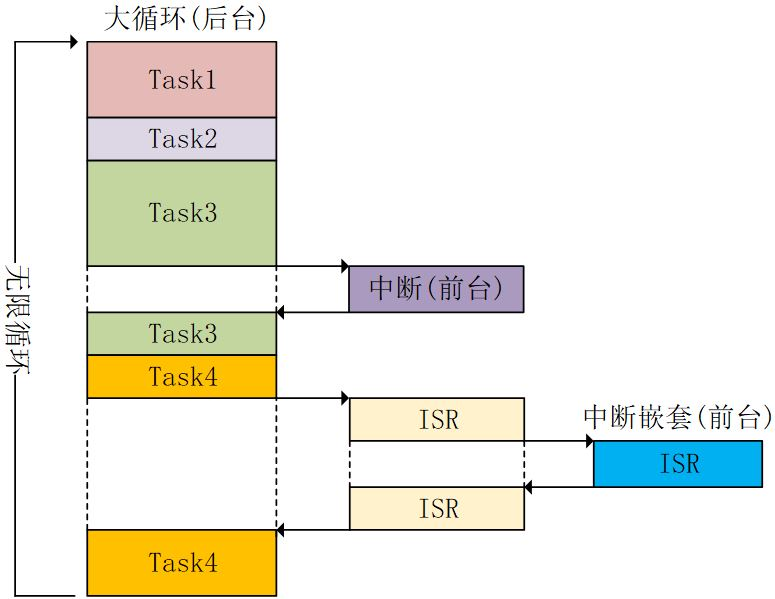

# STM32 FreeRTOS 1_FreeRTOS简介

## 1. RTOS 简介

### 相同优先级的任务处理

对于裸机，同时实现两个任务需要以下代码：

```c
while(1)
{
    Task1();
    Task2();
}
```

这样的缺点在于：单片机必须先完成Task1后才能完成Task2，造成CPU资源浪费.

对于RTOS，其通过创建任务的方式，实现任务的并行处理.

```c
void main()
{
    /* 创建任务1 */
    xTaskCreate(Task1);
    /* 创建任务2 */
    xTaskCreate(Task2);
    //Task1 和 Task2 具有相同优先级
}

void TASK1()
{
    while(1)
    {
        Task1();
    }
}

void TASK2()
{
    while(1)
    {
        Task2();
    }
}
```

在Systick的一个滴答(1ms)内，单片机先处理Task1，随后在下一滴答内处理Task2，以此循环.在宏观上显示为单片机同时执行两个任务。RTOS具有**实时性**。

### 高优先级的任务处理

对于裸机，中断服务函数里不能有太多代码。而且中断阻塞程序进程，不宜写延时函数;

```c
while(1)
{
    Task1();
    Task2();
    /* 在中断服务函数中不能直接执行Task3(耗时过长),使用标志位将标志位置为1 */
    if(Flag == 1)
    {
        Task3();
        Flag == 0;
    }
}
```

单片机先执行Task1，Task2，触发中断后再判断是否执行Task3，使得Task3无法被及时响应；

对于RTOS，其通过创建任务的方式处理高优先级事项；

```c
void main()
{
    /* 创建任务1 */
    xTaskCreate(Task1);
    /* 创建任务2 */
    xTaskCreate(Task2);
    //Task1 和 Task2 具有相同优先级
    /* 创建任务3 */
    xTaskCreate(Task3);
    //Task3具有高优先级
}

void TASK1()
{
    while(1)
    {
        Task1();
    }
}

void TASK2()
{
    while(1)
    {
        Task2();
    }
}

void TASK3()
{
    while(1)
    {
        Task3();
    }
}
```

单片机在中断触发时立刻进入Task3，并停止使用Task1，Task2.
但当Task3进入系统延时(阻塞态)时，RTOS将CPU控制权交给Task1和Task2，充分使用了CPU资源。

## 2. 裸机和FreeRTOS

- 裸机：前后台系统。

> 前台系统：中断服务函数
>
> 后台系统：while(1) 大循环

**特点：** 

1. 实时性差，程序轮流执行;  
2. delay函数中只能空等待，CPU不执行其他代码; 
3. 功能在大循环中实现，结构庞大.



- RTOS：实时操作系统

**特点：**

1. 分而治之；
2. 延时函数中实现任务调度；
3. 高优先级任务抢占低优先级任务；
4. 任务堆栈：每一个任务有自己的栈空间用于保存被打断时的数据。


中断可以打断任意任务，任务可以同等优先级。

## 3. 代码规范

### 变量规范

1. `uint32_t`类型的变量使用前缀`ul`，这里`u`表示`unsigned`，`l`表示`long`
2. `uint16_t`类型的变量使用前缀`us`，这里`u`表示`unsigned`，`s`表示`short`
3. `uint8_t`类型的变量使用前缀`uc`，这里`u`表示`unsigned`，`c`表示`char`
4. 非`stdint`类型的变量使用前缀`x`，比如基本的`Type_t`和`TickType_t`类型，这些类型在移植层定义，定义成符合处理器架构的最高效类型；
5. 非`stdint`类型的无符号变量使用前缀`ux`，比如`UbaseType_t`（`unsigned BaseType_t`）
6. `size_t`类型的变量使用前缀`x`；
7. 枚举类型变量使用前缀`e`
8. 指针类型变量在类型基础上附加前缀`p`，比如指向`uint16_t`的指针变量前缀为`pus`
9. 与MISRA指南一致，`char`类型变量仅被允许保存ASCII字符，前缀为`c`
10. 与MISRA指南一致，`char *`类型变量仅允许指向ASCII字符串，前缀为`pc`

### 函数规范

1. 在文件作用域范围的函数前缀为`prv`
2. API函数的前缀为它们的返回类型，当返回为空时，前缀为`v`
3. API函数名字起始部分为该函数所在的文件名。比如`vTaskDelete`函数定义在`tasks.c`，并且该函数返回空。

### 宏定义规范

1. 宏的名字起始部分为该宏定义所在的文件名的一部分。比如`configUSE_PREEMPTION`定义在`FreeRTOSConfig.h`文件中。

2. 除了前缀，宏剩下的字母全部为大写，两个单词间用下划线（`_`）隔开。

### 数据类型规范

1. `char`：与MISRA编码标准指南一致，`char`类型变量仅被允许保存ASCII字符
2. `char *`：与MISRA编码标准指南一致，`char *`类型变量仅允许指向ASCII字符串。当标准库函数期望一个`char *`参数时，这样做可以消除一些编译器警告；特别是考虑到有些编译器将`char`类型当做`signed`类型，还有些编译器将`char`类型当做`unsigned`类型。
3. `TickType_t`：如果`configUSE_16_BIT_TICKS`为非零（条件为真），`TickType_t`定义为无符号16位类型。如果`configUSE_16_BIT_TICKS`为零（条件为假），`TickType_t`定义为无符号32位类型。注：32位架构的微处理器应设置`configUSE_16_BIT_TICKS`为零。
4. `BaseType_t`：定义为微处理器架构效率最高的数据类型。比如，在32位架构处理器上，`BaseType_t`应该定义为32位类型。在16位架构处理器上，`BaseType_t`应该定义为16位类型。如果`BaseType_t`定义为`char`，对于函数返回值一定要确保使用的是`signed char`，否则可能造成负数错误。
5. `UbaseType_t`：这是一个无符号`BaseType_t`类型。
