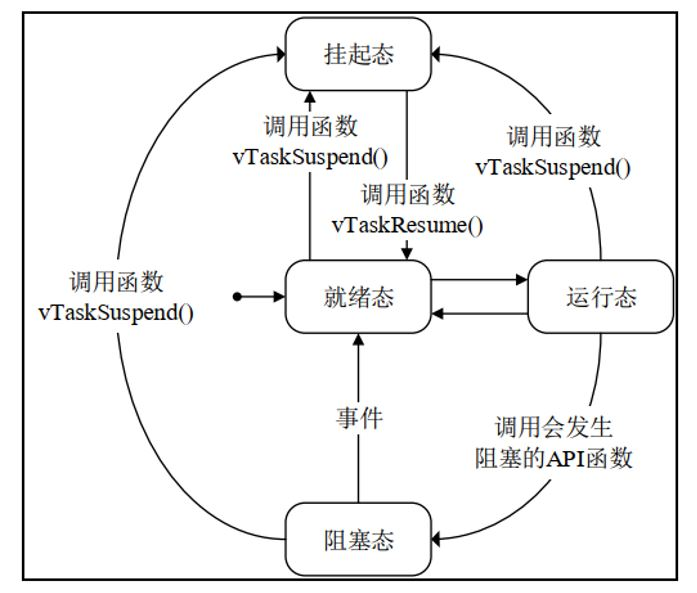
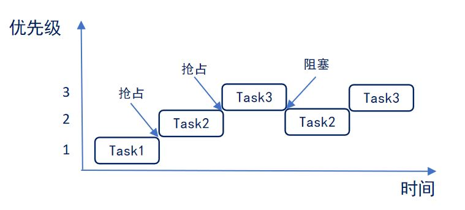
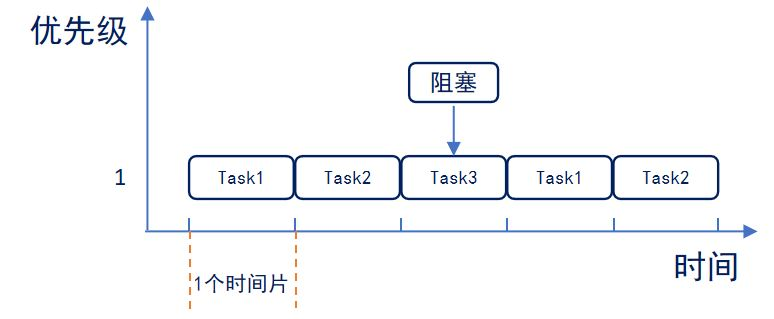

# STM32 FreeRTOS 2_任务

## 1. 任务

### 任务和协程

**任务（Task，又称为线程）**：在多任务系统中，根据功能的不同，把整个系统分割成一个个独立的且无法返回的函数，这些函数称为任务，也可以称之为线程。

**协程**：协程是程序级别，由程序员根据需求自己调度。把一个线程中的一个个函数称为子程序，那么一个子程序在执行的过程中可以中断去执行别的子程序，这就是协程。

> 应用程序可以使用任务也可以使用协程，或者两者混合使用，但是任务和协程使用不同的API函数，因此在任务和协程之间不能使用同一个队列或信号量传递数据。
>
> 通常情况下，协程仅用在资源非常少的微处理器中，特别是RAM非常稀缺的情况下。目前协程很少被使用到，因此对于协程FreeRTOS作者既没有把它删除也没有进一步开发。

​	使用RTOS的实时应用程序可认为是一系列独立任务的集合。**每个任务在自己的环境中运行，不依赖于系统中的其它任务或者RTOS调度器。**

​	在任何时刻，只有一个任务得到运行，RTOS调度器决定运行哪个任务。**调度器会不断的启动、停止每一个任务，宏观看上去就像整个应用程序都在执行。**

​	作为任务，不需要对调度器的活动有所了解，在**任务切入切出时保存上下文环境（寄存器值、堆栈内容）**是调度器主要的职责。为了实现这点，每个任务都需要有自己的堆栈。当任务切出时，它的执行环境会被保存在该任务的堆栈中，这样当再次运行时，就能从堆栈中正确的恢复上次的运行环境。

> - 简单。
> - 没有使用限制。
> - 支持完全抢占。
> - 支持优先级。
> - 每个任务都有自己的堆栈，消耗RAM较多。
> - 如果使用抢占，必须小心的考虑可重入问题。

### 任务的状态

1. **运行态**：正在执行的任务，同一时间仅一个任务在运行态;
2. **就绪态**：就绪的任务已经具备执行的能力（不同于阻塞和挂起），但是因为有一个同优先级或者更高优先级的任务处于运行状态而还没有真正执行。
3. **阻塞态**：如果任务当前正在等待某个时序或外部中断，我们就说这个任务处于阻塞状态。比如一个任务调用`vTaskDelay()`后会阻塞到延时周期到为止。任务也可能阻塞在队列或信号量事件上。**进入阻塞状态的任务通常有一个超时周期，当事件超时后解除阻塞。**
4. **挂起态**：处于挂起状态的任务同样对调度器无效。仅当明确的分别调用`vTaskSuspend()` 和`xTaskResume()`API函数后，任务才会进入或退出挂起状态。不可以指定超时周期事件（不可以通过设定超时事件而退出挂起状态）



### 任务优先级

每个任务都要被指定一个优先级，从`0~configMAX_PRIORITIES`。
> `configMAX_PRIORITIES`定义在`FreeRTOSConfig.h`中。

1. **低优先级数值代表低优先级。**空闲任务（`idle task`）的优先级为0（`tskIDLE_PRIORITY`）。

2. **FreeRTOS调度器确保处于最高优先级的就绪或运行态任务获取处理器**，换句话说，处于运行状态的任务，只有其中的最高优先级任务才会运行。

3. 任何数量的任务可以共享同一个优先级。如果宏configUSE_TIME_SLICING未定义或着宏configUSE_TIME_SLICING定义为1，处于**就绪态的多个相同优先级任务将会以时间片切换的方式共享处理器。**

### 任务的调度

1. **抢占式调度** 
   

Task数值越大，优先级越高。

> Task1运行时Task2就绪，在抢占式调度器的调度下Task2抢占Task1运行;
>
> Task2运行时Task3就绪，在抢占式调度器的调度下Task3抢占Task2运行;
>
> Task3运行时，进入阻塞态(系统延时或等待信号量),此时Task2在就绪态，Task2执行;
>
> Task3阻塞解除，恢复就绪态，抢占Task2运行。
>

2. **时间片调度**

同等优先级任务轮流享有相同CPU时间(时间片)，FreeRTOS中，一个时间片为Systick的中断周期(可设置)。



同等优先级的任务，轮流执行，时间片流转;

Task进入阻塞态时，直接切换到下一个任务，没有用完的时间片不再使用。

所有Task都按照一个时间片执行。

### 任务的结构（函数结构）

```c
void vATaskFunction( void *pvParameters )
{
    for( ;; )
    {
        /*-- 应用程序代码放在这里. --*/
    }
 
    /* 任务不可以从这个函数返回或退出。在较新的FreeRTOS移植包中，如果
    试图从一个任务中返回，将会调用configASSERT()（如果定义的话）。
    如果一个任务确实要退出函数，那么这个任务应调用vTaskDelete(NULL)
    函数，以便处理一些清理工作。*/
    vTaskDelete( NULL );
}
```

1.  **任务函数返回为void，参数只有一个void类型指针**。所有的任务函数都应该是这样。void类型指针可以向任务传递任意类型信息。

2. 任务函数决不应该返回，因此通常**任务函数都是一个死循环**。

3. 任务由`xTaskCreate()`函数创建，由`vTaskDelete()`函数删除。

### 空闲任务

1. **空闲任务是启动RTOS调度器时由内核自动创建的任务**，这样可以确保至少有一个任务在运行。空闲任务具有最低任务优先级，这样如果有其它更高优先级的任务进入就绪态就可以立刻让出CPU。

2. **删除任务后，空闲任务用来释放RTOS分配给被删除任务的内存**。因此，在应用中使用`vTaskDelete()`函数后确保空闲任务能获得处理器时间就很重要了。除此之外，空闲任务没有其它有效功能，所以可以被合理的剥夺处理器时间，并且它的优先级也是最低的。

3. 应用程序任务共享空闲任务优先级（`tskIDLE_PRIORITY`）也是可能的。这种情况如何配置可以参考`configIDLE_SHOULE_YIELD`配置参数类获取更多信息。

#### 空闲任务钩子

 空闲任务钩子是一个函数，每一个空闲任务周期被调用一次。如果将任务程序功能运行在空闲优先级上，可以有两种选择：

> 1. 在一个空闲任务钩子中实现这个功能：因为FreeRTOS必须至少有一个任务处于就绪或运行状态，因此钩子函数不可以调用可能引起空闲任务阻塞的API函数（比如`vTaskDelay()`或者带有超时事件的队列或信号量函数）。
> 2. 创建一个具有空闲优先级的任务去实现这个功能：这是个更灵活的解决方案，但是会带来更多RAM开销。
> 3. 空闲任务会负责释放被删除任务中由系统分配的内存，但是由用户在任务删除前申请的内存，则需要由用户在任务被删除前提前释放，否则将导致内存泄露。

- 空闲任务钩子创建：

1. 在`FreeRTOSConfig.h`头文件中设置`configUSE_IDLE_HOOK`为1；

2. 定义如下函数：

   ```c
   void vApplicationIdleHook( void );
   ```

   **一般的，使用空闲钩子函数设置CPU进入低功耗模式**。

## 2. 任务的API函数(标准API)

### 任务创建与删除

```c
/**
  * @brief 任务创建函数
  * @param pvTaskCode 指针，指向任务函数的入口。
  * @param pcName 任务描述。主要用于调试。字符串的最大长度由宏configMAX_TASK_NAME_LEN指定，该宏位于FreeRTOSConfig.h文件中。
  * @param usStackDepth 指定任务堆栈大小，能够支持的堆栈变量数量，而不是字节数。堆栈的宽度乘以深度必须不超过size_t类型所能表示的最大值。
  * @param pvParameters 指针，当任务创建时，作为一个参数传递给任务。
  * @param uxPriority 任务的优先级。
  * @param pvCreatedTask：用于回传一个句柄（ID），创建任务后可以使用这个句柄引用任务。
  */
BaseType_t xTaskCreate(
           				TaskFunction_t pvTaskCode,
                        const char * const pcName,
                        unsigned short usStackDepth,
                        void *pvParameters,
                        UBaseType_t uxPriority,
                        TaskHandle_t * pvCreatedTask
                       );

/**
  * @brief 任务删除函数
  * @param xTask 任务句柄。
  * @attention 从RTOS内核管理器中删除一个任务。任务删除后将会从就绪、阻塞、暂停和事件列表中移除。在文件FreeRTOSConfig.h中，必须定义宏INCLUDE_vTaskDelete 为1，本函数才有效。
  * @attention 被删除的任务，其在任务创建时由内核分配的存储空间，会由空闲任务释放。如果有应用程序调用xTaskDelete()，必须保证空闲任务获取一定的微控制器处理时间。任务代码自己分配的内存是不会自动释放的，因此删除任务前，应该将这些内存释放。
  */
void vTaskDelete(TaskHandle_t xTask);
```

### 任务延时

**相对延时**：指每次延时都是从执行函数`vTaskDelay()`开始，直到延时指定的时间结束。

**绝对延时**：指将整个任务的运行周期看成一个整体，适用于需要按照一定频率运行的任务。

```c
/**
  * @brief 相对延时函数
  * @param xTicksToDelay 系统节拍数(1ms)
  */
void vTaskDelay( const TickType_t xTicksToDelay );

/**
  * @brief 绝对延时函数
  * @param pxPreviousWakeTime 保存上次唤醒时间的指针,使用xTaskGetTickCount()获得
  * @param xTimeIncrement 周期循环时间。当时间等于(*pxPreviousWakeTime + xTimeIncrement)时，任务解除阻塞。如果不改变参数xTimeIncrement的值，调用该函数的任务会按照固定频率执行。
  */
void vTaskDelayUntil( TickType_t * const pxPreviousWakeTime, const TickType_t xTimeIncrement);
```

> 1. 调用`vTaskDelay()`函数后，任务会进入阻塞状态，持续时间由`vTaskDelay()`函数的参数指定，单位是系统节拍时钟周期。因此`vTaskDelay()`并不适用于周期性执行任务的场合。因为调用`vTaskDelay()`到任务解除阻塞的时间不总是固定的并且该任务下一次调用`vTaskDelay()`函数的时间也不总是固定的（两次执行同一任务的时间间隔本身就不固定，中断或高优先级任务抢占也可能会改变每一次执行时间）。
> 2. `vTaskDelay()`指定一个从调用`vTaskDelay()`函数后开始计时，到任务解除阻塞为止的相对时间，而`vTaskDelayUntil()`指定一个绝对时间，每当时间到达，则解除任务阻塞。
> 3. 如果指定的唤醒时间已经达到，`vTaskDelayUntil()`立刻返回（不会有阻塞）。因此，使用`vTaskDelayUntil()`周期性执行的任务，无论任何原因（比如，任务临时进入挂起状态）停止了周期性执行，使得任务少运行了一个或多个执行周期，那么需要重新计算所需要的唤醒时间。

```c
//每10次系统节拍执行一次
 void vTaskFunction( void * pvParameters )
 {
     static portTickType xLastWakeTime;
     const portTickType xFrequency = 10;
 
     /** 使用当前时间初始化变量xLastWakeTime **/
     xLastWakeTime = xTaskGetTickCount();
 
     for( ;; )
     {
         /** 等待下一个周期 **/
         vTaskDelayUntil( &xLastWakeTime,xFrequency );
 
         /** 需要周期性执行代码放在这里 **/
     }
 }
```

### 任务挂起和解挂

```c
/**
  * @brief 任务挂起函数
  * @param xTaskToSuspend 需要挂起的任务
  * @attention 此函数用于挂起任务，使用时需将宏 INCLUDE_vTaskSuspend 配置为 1。
  */
void vTaskSuspend(TaskHandle_t xTaskToSuspend);
```

无论优先级如何，**被挂起的任务都将不再被执行**，直到任务被恢复。

当传入的参数为NULL，则代表挂起任务自身（当前正在运行的任务）。

```c
/**
  * @brief 任务解挂函数
  * @param xTaskToSuspend 需要解挂的任务
  * @attention 此函数用于解挂任务，使用时需将宏 INCLUDE_vTaskSuspend 配置为 1。
  */
void vTaskResume(TaskHandle_t xTaskToResume);
```

任务无论被 `vTaskSuspend()` 挂起多少次，只需在任务中调用` vTakResume()` 恢复一次，就可以继续运行。且被恢复的任务会进入就绪态。

```c
/**
  * @brief 任务解挂函数(中断)
  * @param xTaskToSuspend 需要解挂的任务
  * @attention 此函数用于在中断中解挂任务，使用时需将宏 INCLUDE_vTaskSuspend 配置为 1。
  */
BaseType_t xTaskResumeFromISR(TaskHandle_t xTaskToResume);
```

**中断服务程序中要调用FreeRTOS的API函数则中断优先级不能高于FreeRTOS所管理的最高优先级。**

`xTaskResumeFromISR()`不可用于任务和中断间的同步，如果中断恰巧在任务被挂起之前到达，这就会导致一次中断丢失（任务还没有挂起，调用`xTaskResumeFromISR()`函数是没有意义的，只能等下一次中断）。这种情况下，可以使用信号量作为同步机制。

| 返回值    | 描述                                                         |
| --------- | ------------------------------------------------------------ |
| `pdTRUE`  | 任务恢复后需要进行任务切换，恢复运行的任务的优先级等于或高于正在运行的任务。 |
| `pdFALSE` | 任务恢复后不需要进行任务切换，恢复运行的任务的优先级低于当前正在运行的任务。 |

```c
void vAnExampleISR( void )
 {
     portBASE_TYPE xYieldRequired;
 
     /** 恢复被挂起的任务 **/
     xYieldRequired = xTaskResumeFromISR(xHandle );
 
     if( xYieldRequired == pdTRUE )
     {
         /** 进行一次上下文切换 **/
         portYIELD_FROM_ISR();
     }
 }
```

### 任务通知

每个RTOS任务都有一个32位的通知值，任务创建时，这个值被初始化为0。

RTOS任务通知相当于直接向任务发送一个事件，**接收到通知的任务可以解除阻塞状态**，前提是这个**阻塞事件是因等待通知而引起的**。

发送通知的同时，也可以可选的改变接收任务的通知值。

 可以通过下列方法向接收任务更新通知：

>- 不覆盖接收任务的通知值
>- 覆盖接收任务的通知值
>- 设置接收任务通知值的某些位
>- 增加接收任务的通知值

**相对于用前必须分别创建队列、二值信号量、计数信号量或事件组的情况，使用任务通知更灵活。**

RTOS任务通知速度更快并且占用内存更少，但也有限制：

> - 只能有一个任务接收通知事件。
> - 接收通知的任务可以因为等待通知而进入阻塞状态，但是发送通知的任务即便不能立即完成通知发送也不能进入阻塞状态。

```c
/**
  * @brief  向指定任务发送指定的通知值
  * @param xTaskToNotify 被通知的任务句柄。
  * @param ulValue 通知更新值
  * @param eAction 枚举类型，指明更新通知值的方法
  */
BaseType_t xTaskNotify(TaskHandle_t xTaskToNotify,uint32_t ulValue,eNotifyAction eAction);
```

枚举类型eNotifyAction可选值如下表：

| 枚举成员                    | 描述                                                         |
| --------------------------- | ------------------------------------------------------------ |
| `eNoAction`                 | 发送通知但是不更新通知值。                                   |
| `eSetBits`                  | 被通知任务的通知值按位或上`ulValue`，在某些场景下可替代事件组。 |
| `eIncrement`                | 被通知任务的通知值加一。                                     |
| `eSetValueWithOverwrite`    | 被通知任务的通知值设置为`ulValue`                            |
| `eSetValueWithoutOverwrite` | 被通知任务当前没有通知，则通知值设置为`ulValue`。<br>如果被通知任务未取走上一个任务的通知，又接收到这一次的通知，则通知值被丢弃。            |

> 简化后的通知发送函数为
>
> ```c
> BaseType_t xTaskNotifyGive(TaskHandle_t xTaskToNotify );
> ```
>
> 相当于
>
> ```c
> xTaskNotify((xTaskToNotify ),(0), eIncrement);
> ```
>
> 可以使用该API函数代替二进制或计数信号量，但速度更快。
>
> 在这种情况下，应该使用API函数`ulTaskNotifyTake()`来等待通知，而不应该使用API函数`xTaskNotifyWait()`。

```c
/**
  * @brief  获取通知值
  * @param xClearCountOnExit 如果该参数设置为pdFALSE，则退出前将任务的通知值减1；如果该参数设置为pdTRUE，则退出前，将任务通知值清零。
  * @param xTicksToWait 因等待通知而进入阻塞状态的最大时间。时间单位为系统节拍周期。宏pdMS_TO_TICKS用于将指定的毫秒时间转化为相应的系统节拍数。
  */
uint32_t ulTaskNotifyTake( BaseType_t xClearCountOnExit,TickType_txTicksToWait );
```

```c
/**
  * @brief  等待通知值
  * @param ulBitsToClearOnEntry 在使用通知之前，先将任务的通知值与参数ulBitsToClearOnEntry的按位取反值按位与操作。设置参数ulBitsToClearOnEntry为0xFFFFFFFF(ULONG_MAX)，表示清零任务通知值。
  * @param ulBitsToClearOnExit 在函数xTaskNotifyWait()退出前，将任务的通知值与参数ulBitsToClearOnExit的按位取反值按位与操作。设置参数ulBitsToClearOnExit为0xFFFFFFFF(ULONG_MAX)，表示清零任务通知值。
  * @param pulNotificationValue 用于向外回传任务的通知值。这个通知值在参数ulBitsToClearOnExit起作用前将通知值拷贝到*pulNotificationValue中。如果不需要返回任务的通知值，这里设置成NULL。
  * @param 因等待通知而进入阻塞状态的最大时间。时间单位为系统节拍周期。
  */
BaseType_t xTaskNotifyWait( uint32_t ulBitsToClearOnEntry,uint32_t ulBitsToClearOnExit,uint32_t* pulNotificationValue,TickType_t xTicksToWait );
```

```c
/**
  * @brief 任务通知并查询
  * @param xTaskToNotify：被通知的任务句柄。
  * @param ulValue：通知更新值
  * @param eAction：枚举类型，指明更新通知值的方法，枚举变量成员以及作用见xTaskNotify()一节。
  * @param pulPreviousNotifyValue：回传未被更新的任务通知值。如果不需要回传未被更新的任务通知值，这里设置为NULL，这样就等价于调用xTaskNotify()函数。
  */
BaseType_t xTaskNotifyAndQuery(TaskHandle_t xTaskToNotify,uint32_t ulValue,eNotifyAction eAction,uint32_t* pulPreviousNotifyValue );
```

### 辅助函数(调试可选)

```c
/**
  * @brief 获取任务系统状态
  * @attention 该函数向TaskStatus_t结构体填充相关信息，系统中每一个任务的信息都可以填充到TaskStatus_t结构体数组中，数组大小由uxArraySize指定。
  * @attention 这个函数仅用来调试用，调用此函数会挂起所有任务，直到函数最后才恢复挂起的任务，因此任务可能被挂起很长时间。
  * @param pxTaskStatusArray 指向TaskStatus_t类型的结构体数组。这个数组至少要包含1个元素。RTOS控制的任务数量可以使用API函数uxTaskGetNumberOfTasks()获取。
  * @param uxArraySize：参数pxTaskStatusArray指向的数组大小，也就是该数组的索引数目。
  * @param 如果在文件FreeRTOSConfig.h中设置宏configGENERATE_RUN_TIME_STATS为1，则该函数将总运行时间写入*pulTotalRunTime中。pulTotalRunTime可以设置为NULL，表示忽略总运行时间。
  */
UBaseType_t uxTaskGetSystemState(TaskStatus_t * constpxTaskStatusArray,const UBaseType_tuxArraySize,unsigned long * constpulTotalRunTime );

/**
  * @brief 任务结构体
  */
typedef struct xTASK_STATUS
{
   /* 任务句柄*/
   TaskHandle_t xHandle;
 
   /* 指针，指向任务名*/
   const signed char *pcTaskName;
 
   /*任务ID，是一个独一无二的数字*/
   UBaseType_t xTaskNumber;
 
   /*填充结构体时，任务当前的状态（运行、就绪、挂起等等）*/
   eTaskState eCurrentState;
 
   /*填充结构体时，任务运行（或继承）的优先级。*/
   UBaseType_t uxCurrentPriority;
 
   /* 当任务因继承而改变优先级时，该变量保存任务最初的优先级。仅当configUSE_MUTEXES定义为1有效。*/
   UBaseType_t uxBasePriority;
 
   /* 分配给任务的总运行时间。仅当宏configGENERATE_RUN_TIME_STATS为1时有效。*/
   unsigned long ulRunTimeCounter;
 
   /* 从任务创建起，堆栈剩余的最小数量，这个值越接近0，堆栈溢出的可能越大。 */
   unsigned short usStackHighWaterMark;
}TaskStatus_t;
```

```c
/**
  * @brief 获取当前任务句柄
  */
TaskHandle_t xTaskGetCurrentTaskHandle(void);
```

```c
/**
  * @brief 获取空闲任务句柄
  */
TaskHandle_t xTaskGetIdleTaskHandle(void);
```

```c
/**
  * @brief 获取任务堆栈最大使用深度
  * @param xTask：任务句柄。NULL表示查看当前任务的堆栈使用情况。
  * @retval 返回最小剩余堆栈空间，以字为单位。比如一个32为架构处理器，返回值为1表示有4字节堆栈空间没有使用过。如果返回值为0，则任务很可能已经发生了堆栈溢出。
  */
UBaseType_t uxTaskGetStackHighWaterMark( TaskHandle_t xTask );
```

```c
/**
  * @brief 获取任务状态
  * @param xTask：任务句柄。NULL表示查看当前任务的堆栈使用情况。
  * @retval eReady 就绪态；eRunning 运行态；eBlocked 阻塞态；eSuspended 挂起；eDelete 删除。
  */
eTaskState eTaskGetState( TaskHandle_txTask );
```

```c
/**
  * @brief 获取任务描述内容
  * @param xTaskToQuery 任务的句柄。NULL表示获取当前任务的描述内容指针。
  */
char* pcTaskGetTaskName( TaskHandle_t xTaskToQuery );
```

```c
/**
  * @brief 获取系统节拍次数
  * @retval 返回从vTaskStartScheduler函数调用后的系统时钟节拍次数。
  */
volatile TickType_t xTaskGetTickCount(void);
```

```c
/**
  * @brief 获取调度器状态
  * @retval taskSCHEDULER_NOT_STARTED（未启动）;taskSCHEDULER_RUNNING（正常运行）;taskSCHEDULER_SUSPENDED（挂起）。
  */
BaseType_t xTaskGetSchedulerState(void);
```

```c
/**
  * @brief 获取任务总数
  * @retval 返回RTOS内核当前管理的任务总数。
  */
UBaseType_t uxTaskGetNumberOfTasks(void);
```

```c
/**
  * @brief 获取所有任务详情
  * @retval 将每个任务的状态、堆栈使用情况等以字符的形式保存到参数pcWriteBuffer指向的区域。vTaskList()函数调用usTaskGetSystemState()函数，然后将得到的信息格式化为程序员易读的字符形式。B表示阻塞、R表示就绪、D表示删除（等待清除内存）、S表示挂起或阻塞。
  * @attention 调用这个函数会挂起所有任务，这一过程可能持续较长时间，因此本函数仅在调试时使用。
  */
void vTaskList(char *pcWriteBuffer );
```

```c
/**
  * @brief 获取任务运行时间
  * @param 将每个任务的状态、堆栈使用情况等以字符的形式保存到参数pcWriteBuffer指向的区域。vTaskList()函数调用usTaskGetSystemState()函数，然后将得到的信息格式化为程序员易读的字符形式。B表示阻塞、R表示就绪、D表示删除（等待清除内存）、S表示挂起或阻塞。
  */
void vTaskGetRunTimeStats(char* pcWriteBuffer );
```

```c
/**
  * @brief 设置任务标签值
  * @param xTask：任务句柄。NULL表示当前任务。
  * @param pxTagValue：要分配给任务的标签值。这是一个TaskHookFunction_t类型的函数指针，但也可以给任务标签分配任意的值。
  */
void vTaskSetApplicationTaskTag( TaskHandle_t xTask,TaskHookFunction_t pxTagValue );
```

```c
/**
  * @brief 获取任务标签值
  * @param xTask：任务句柄。NULL表示当前任务。
  */
TaskHookFunction_t xTaskGetApplicationTaskTag( TaskHandle_t xTask );
```

```c
/**
  * @brief 执行任务的应用钩子函数
  * @attention 可以为每个任务分配一个标签值，当这个值是一个TaskHookFunction_t类型函数指针时，相当于应用程序向任务注册了一个回调函数，而API函数xTaskCallApplicationTaskHook用来调用这个回调函数。
  * @param xTask：任务句柄。NULL表示当前任务。
  * @param pvParameter：作为参数传递给应用钩子函数
  */
BaseType_txTaskCallApplicationTaskHook(TaskHandle_t xTask,void* pvParameter );
```

## 3. 任务的API函数(CMSIS API)

### 线程的创建

```c
/**
  * @brief 线程定义
  * @param name 线程名称
  * @param thread 线程函数
  * @param priority 线程优先级
  * @param instances 线程状态，一般取0.
  * @param stacksz 线程堆栈大小，一般取128
  */
#define osThreadDef(name, thread, priority, instances, stacksz)  \
const osThreadDef_t os_thread_def_##name = \
{ #name, (thread), (priority), (instances), (stacksz), NULL, NULL }

/**
  * @brief 线程优先级定义结构体
  */
typedef enum  {
  osPriorityIdle          = -3,          ///< priority: idle (lowest)
  osPriorityLow           = -2,          ///< priority: low
  osPriorityBelowNormal   = -1,          ///< priority: below normal
  osPriorityNormal        =  0,          ///< priority: normal (default)
  osPriorityAboveNormal   = +1,          ///< priority: above normal
  osPriorityHigh          = +2,          ///< priority: high
  osPriorityRealtime      = +3,          ///< priority: realtime (highest)
  osPriorityError         =  0x84        ///< system cannot determine priority or thread has illegal priority
} osPriority;

/**
  * @brief 线程创建函数
  * @param name 线程名称
  * @param thread 线程函数
  * @param priority 线程优先级
  * @param instances 线程状态，一般取0.
  * @param stacksz 线程堆栈大小，一般取128
  */
osThreadId osThreadCreate (const osThreadDef_t *thread_def, void *argument);
```

### 延时函数

```c
/**
  * @brief 相对延时函数
  * @param millisec 延时毫秒数
  */
osStatus osDelay (uint32_t millisec);

/**
  * @brief 绝对延时函数
  * @param PreviousWakeTime 延时系统时钟
  * @param millisec 延时系统时钟数，使用pdMS_TO_TICK宏可以将毫秒数转换为系统节拍数
  */
osStatus osDelayUntil (uint32_t *PreviousWakeTime, uint32_t millisec)；
    
void Task(void const * argument)
{
  static portTickType xlastwaketime;
  /* 使用 pdMS_TO_TICK 宏转换为系统tick */
  const portTickType xfrequent = pdMS_TO_TICKS(1000); 
  /* 获取当前系统时间 */
  xlastwaketime = osKernelSysTick();
  for(;;)
  {
    osDelayUntil(&xlastwaketime,xfrequent);
   	/* 任务代码 */
  }
}
```

### 线程挂起和解挂

```c
/**
  * @brief 线程挂起函数
  * @param thread_id 线程ID
  */
osStatus osThreadSuspend (osThreadId thread_id);

/**
  * @brief 线程解挂函数
  * @param thread_id 线程ID
  */
osStatus osThreadResume (osThreadId thread_id)；
```

