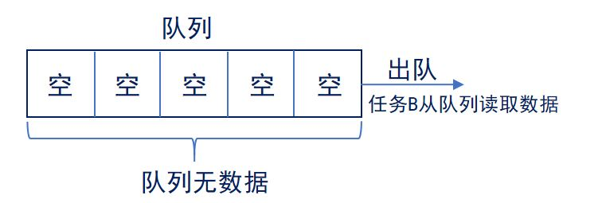

# STM32 FreeRTOS 3_队列(Queue)

## 1. 消息队列（Message）

### 消息队列特性

**队列**是任务到任务、任务到中断、中断到任务数据交流的一种机制（消息传递）。

> 全局变量的缺点：
>
> 数据无保护，导致数据不安全，当多个任务同时对该变量操作时，数据易受损。 

在队列中可以存储数量有限、大小固定的数据。队列中的每一个数据叫做**队列项目**，队列能够存储队列项目的最大数量称为**队列长度**。在创建队列时，要指定队列长度以及队列项目的大小。

#### 队列特性

1. 入队和出队：队列通常采用“先进先出” **(FIFO)** 的数据存储缓冲机制，即***先入队的数据会先从队列中被读取***，FreeRTOS中也可以配置为“后进先出”(LIFO)方式；

> 任务A使用API函数`xQueueSendToBack()`向队列发送数据，每次发送一个数据，新入队的数据置于上一次入队数据的后面。任务B使用API函数`xQueueReceive()`将数据从队列取出，先入队的数据先出队。

2. 简单数据传递：C变量（整形、简单结构体等等）中的**简单信息可以直接通过拷贝的方式传送到队列**。这样就不需要为信息分配缓存也不需要再进行什么拷贝工作。同样的，信息可以直接从队列读取到C变量中。用直接拷贝的方法入队，可以允许任务立即覆写已经入队的变量或者缓存，实际上队列中已经保存了这些变量或缓冲区携带的信息。因为变量中的数据内容是以拷贝的方式入队的，所以变量自身是允许重复使用的。发送信息的任务和接收信息的任务并不需要就哪个任务拥有信息、哪个任务释放信息（当信息不再使用时）而达成一致。
3. 大型数据传递：当信息的大小到达一个临界点后，逐字节拷贝整个信息是不实际的，可以**定义一个指针队列，只拷贝指向消息的指针来代替整个信息拷贝**。

4. 不定长数据传递：变长消息可以通过定义保存一个结构体变量的队列实现，结构体一个成员指向要入队的缓存，另一个成员保存缓存数据的大小。
5. 不同类型数据传递：单个队列可以接收不同类型信息，并且信息可以来自不同的位置。通过定义保存一个结构体变量的队列来实现，结构体的一个成员保存信息类型，另一个成员保存信息数据（或者指向信息数据的指针）。

6. 多任务访问：队列不属于某个任务，**任何任务和中断都可以向队列发送/读取消息**。

#### 队列阻塞

1. 出队阻塞：**每当任务企图从一个空的队列读取数据时，任务会进入阻塞状态**（这样任务不会消耗任何CPU时间并且另一个任务可以运行）直到队列中出现有效数据或者阻塞时间到期。



2. 入队阻塞：**每当任务企图向一个满的队列写数据时，任务会进入阻塞状态**，直到队列中出现有效空间或者阻塞时间到期。


3. 多队列阻塞： 如果多个任务阻塞在一个队列上，那么**最高优先级的任务会第一个解除阻塞**。（或者同优先级时等待时间最长的优先解除阻塞）。

### 消息队列API函数（标准API）

#### 消息队列的创建和删除

```c
/**
  * @brief 队列创建函数
  * @param usQueueLength 队列项数目
  * @param uxItemSize 每个队列项大小，单位是字节。队列项通过拷贝入队而不是通过引用入队，因此需要队列项的大小。每个队列项的大小必须相同。
  * @retval 成功创建队列返回队列句柄，否则返回0
  */
QueueHandle_t xQueueCreate(UBaseType_t uxQueueLength, UBaseType_t uxItemSize);

/**
  * @brief 队列删除函数
  * @param xQueue 队列句柄
  */
void vQueueDelete(QueueHandle_t xQueue);
```

#### 队列的发送和读取

```c
/**
  * @brief 队列发送函数
  * @param xQueue 队列句柄。
  * @param pvItemToQueue 指针，指向要入队的项目。
  * @param xTicksToWait 如果队列满，任务等待队列空闲的最大时间。portMAX_DELAY使得队列可引发无限阻塞。
  */
BaseType_t xQueueSend(QueueHandle_t xQueue,const void* pvItemToQueue, TickType_t xTicksToWait );

/**
  * @brief 向队列尾部发送函数
  * @param xQueue 队列句柄。
  * @param pvItemToQueue 指针，指向要入队的项目。
  * @param xTicksToWait 如果队列满，任务等待队列空闲的最大时间。portMAX_DELAY使得队列可引发无限阻塞。
  */
BaseType_t xQueueSendToBack(QueueHandle_t xQueue,const void * pvItemToQueue, TickType_t xTicksToWait);

/**
  * @brief 向队列头部发送函数
  * @param xQueue 队列句柄。
  * @param pvItemToQueue 指针，指向要入队的项目。
  * @param xTicksToWait 如果队列满，任务等待队列空闲的最大时间。portMAX_DELAY使得队列可引发无限阻塞。
  */
BaseType_t xQueueSendToFront(QueueHandle_t xQueue,const void * pvItemToQueue, TickType_t xTicksToWait);

/**
  * @brief 读取并移除队列项
  * @param pxQueue 队列句柄。
  * @param pvBuffer 指向一个缓冲区，用于拷贝接收到的列表项。
  * @param xTicksToWait 要接收的项目队列为空时，允许任务最大阻塞时间。
  */
BaseType_t xQueueReceive(QueueHandle_t xQueue,void *pvBuffer,TickType_t xTicksToWait);

/**
  * @brief 读取不移除队列项
  * @param pxQueue 队列句柄。
  * @param pvBuffer 指向一个缓冲区，用于拷贝接收到的列表项。
  * @param xTicksToWait 要接收的项目队列为空时，允许任务最大阻塞时间。
  */
BaseType_t xQueuePeek(QueueHandle_t xQueue,void *pvBuffer, TickType_t xTicksToWait);
```


### 消息队列API函数（CMSIS API）

#### 消息队列的创建和删除

```c
/**
  * @brief 队列消息创建宏定义
  * @param name 队列名
  * @param queue_sz 指定消息队列可容纳消息的上限
  * @param type 指定消息的类型，如果是整形就指定为uint32_t等整数类型，如果是指针，就指定指针类型。
  */
#define osMessageQDef(name, queue_sz, type) \
const osMessageQDef_t os_messageQ_def_##name = { (queue_sz), sizeof(type)}

/**
  * @brief 队列创建函数
  * @param queue_def 通过osMessageQ宏来指定osMessageQDef宏所定义结构体变量的地址
  * @param thread_id：指定创建该消息队列的线程的 ID，一般不需要，不需要时就设置为 NULL。
  * @retval 返回唯一识别消息队列的 ID，后续就是通过这个 ID 来操作消息队列。
  */
osMessageQId osMessageCreate (const osMessageQDef_t *queue_def, osThreadId thread_id);
```

#### 消息队列的发送和读取

```c
/**
  * @brief 队列发送函数
  * @param queue_id 指定消息队列的 ID，用于识别消息队列，然后将消息挂到该消息队列上。
  * @param info 如果发送的是整形数就直接写该整形数，如果是指针则强转为 uint32_t 类型。
  * @param millisec 超时设置
  * @param osWaitForever：表示如果没有发送成功就一直休眠（阻塞），直到发送成功为止
0：则表示不管发送成功没有都立即返回，发送消息时一般都设置为 0。
  */
osStatus osMessagePut(osMessageQId queue_id,uint32_t info,uint32_t millisec);

/**
  * @brief 队列接收函数
  * @param queue_id 指定消息队列的 ID，用于识别消息队列，然后将消息挂到该消息队列上。
  * @param millisec 超时设置
  * @param osWaitForever：表示如果没有发送成功就一直休眠（阻塞），直到发送成功为止
0：则表示不管发送成功没有都立即返回，发送消息时一般都设置为 0。
  * @retval
  */
osEvent osMessageGet(osMessageQId queue_id,uint32_t millisec);

typedef struct  
{
  osStatus                 status;     //成功接收到消息时：里面放的是osEventMessage，只要检测到里面放的是osEventMessage，就表示成功接收到了消息。超时：里面放的是osEventTimeout。
  union  
  {
    uint32_t                    v;     
    void                       *p;     //如果传输的是一个整形数：value 里面放的这个整形数，使用v来获取这个整形数如果传递的是一个指针：value里面放的就是这个指针，此时我们需要使用p来获取该指针，由于类型为void *，使用是需要强转为需要的指针类型。
    int32_t               signals;     
  }value;                             
  union  
  {
    osMailQId             mail_id;    
    osMessageQId       message_id;     
  }def;                               //目前使用的是消息队列，因此里面放的是消息队列的ID，通过osMailQId即可取出消息队列的ID句柄。
} osEvent;
```

## 2. 信号（Signal）

信号类似于事件标志组，向指定线程发送一个整型数。范围为`0~0x80000000`。其中，`0x80000000`作为错误信号。

### 信号API函数（CMSIS API）

```c
/**
  * @brief 信号发送函数
  * @param thread_id 线程ID
  * @param signal 信号整型数
  */
int32_t osSignalSet(osThreadId thread_id,int32_t signal);

/**
  * @brief 信号接收函数
  * @param signals 指定信号数
  * @param millisec 超时时间
  */
osEvent osSignalWait (int32_t signals, uint32_t millisec);
```

## 3. 内存池（Pool）

从堆中动态分配空间时可以使用`malloc`函数，但是为了安全起见，RTOS提供了更加安全的内存池这个东西，作用与`malloc`一样，所以运行RTOS时完全可以使用内存池来代替C库的`malloc`函数。

在消息队列中，发送消息的线程会将`msg`的地址发送给对方线程，结构体变量`msg`为线程函数的局部变量，而且`msg`里面包含非常占用空间的数组，由于线程函数的栈比较小（一般指定为 128），为了减少对栈空间的消耗，可以使用内存池来开辟`msg`的空间。

### 内存池API函数（CMSIS API）

```c
/**
  * @brief 内存池结构体定义函数
  * @param name 指定名字，结构体变量会加os_pool_def_前缀。
  * @param no 指定内存池的最大块数，内存池是按块来管理的。
  * @param type 指定开辟空间时所用的类型
  */
#define osPoolDef(name, no, type) \
const osPoolDef_t os_pool_def_##name = {(no), sizeof(type), NULL}

/**
  * @brief 使用osPoolDef所定义的数据结构来创建一个内存池
  * @param pool_def 指定osPoolDef宏所定义的结构体变量的地址，此时需要使用osPool宏
  * @retval 返回唯一识别内存池的ID
  */
osPoolId osPoolCreate(const osPoolDef_t *pool_def);

/**
  * @brief 从pool_id所指向的内存池中开辟空间，大小为osPoolDef第三个参数所指定类型的大小，osPoolAlloc的特点是开辟空间后不会对空间清零。
  * @param pool_id 内存池 ID
  * @retval 调用成功就返回开辟空间的地址（指针），开辟空间失败就返回 NULL
由于返回类型是void *，因此需要强转为需要的指针类型。
  */
void * osPoolAlloc(osPoolId pool_id);

/**
  * @brief 从pool_id所指向的内存池中开辟空间，大小为osPoolDef第三个参数所指定类型的大小，osPoolAlloc的特点是开辟空间后会对空间清零。
  * @param pool_id 内存池 ID
  * @retval 调用成功就返回开辟空间的地址（指针），开辟空间失败就返回 NULL
由于返回类型是void *，因此需要强转为需要的指针类型。
  */
void * osPoolCAlloc(osPoolId pool_id);

/**
  * @brief 释放开辟的空间
  * @param pool_id 内存池 ID
  * @param block 所开辟空间的指针
  */
osStatus osPoolFree(osPoolId pool_id,void *block);
```

## 4. 邮箱队列（Mail）

在内存池中，使用内存池来开辟msg的空间，然后使用消息队列将空间指针发送给另一个线程，两个线程就可以共操作同一个空间，以实现数据交换。

使用消息队列和内存池这种结合方式时，不仅需要创建消息队列，还要创建内存池，这就会比较麻烦，而邮箱队列可以一步到位，所以邮箱队列就是消息队列和内存池相结合后的产物，**邮箱队列的作用就是开辟一段内存空间，然后将空间指针发送给对方线程。**

 ### 邮箱队列API函数（CMSIS API）

```c
/**
  * @brief 邮箱队列结构体定义函数
  * @param name 指定名字，结构体变量会加os_mailQ_def_前缀。
  * @param queue_sz 指定邮箱队列所挂消息上限。
  * @param type 指定开辟空间时所用的类型
  */
#define osMailQDef(name, queue_sz, type) \
struct os_mailQ_cb *os_mailQ_cb_##name; \
const osMailQDef_t os_mailQ_def_##name = { (queue_sz), sizeof(type), (
&os_mailQ_cb_##name) }

/**
  * @brief 创建邮箱队列
  * @param queue_def：指定 osMailQDef 宏所定义结构体变量的地址，需要用到 osMailQ 宏
  * @param thread_id 指定接收消息的那个线程的 ID
  * @retval 函数调用成功就返回邮箱队列的 ID
  */
osMailQId osMailCreate(const osMailQDef_t *queue_def,osThreadId thread_id);

/**
  * @brief 在内存池中开辟空间
  * @param queue_id 邮箱队列的 ID。
  * @param millisec 指定超时时间。
  */
void *osMailAlloc(osMailQId queue_id, uint32_t millisec);
void * osMailCAlloc(osMailQId queue_id,uint32_t millisec);

/**
  * @brief 释放内存空间
  * @param queue_id 邮箱队列的 ID。
  * @param mail 开辟空间的指针
  */
osStatus osMailFree(osMailQId queue_id, void *mail);

/**
  * @brief 发送邮箱消息
  * @param queue_id 邮箱队列的 ID。
  * @param mail 开辟空间的指针
  */
osStatus osMailPut(osMailQId queue_id, void *mail);

/**
  * @brief 接受邮箱消息
  * @param queue_id 邮箱队列的 ID。
  * @param millisec 指定超时时间。
  */
osEvent osMailGet(osMailQId queue_id, uint32_t millisec)
```

