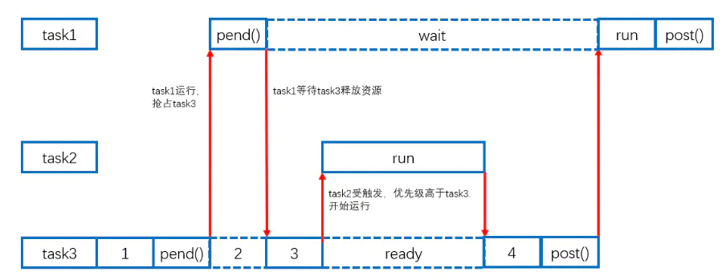
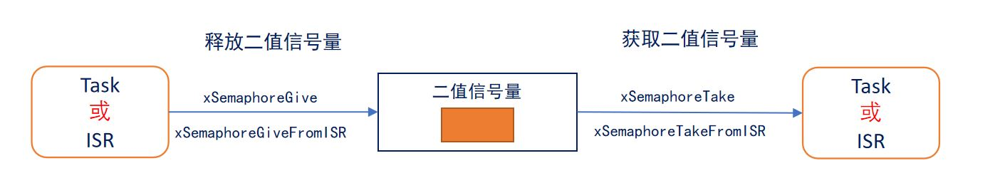
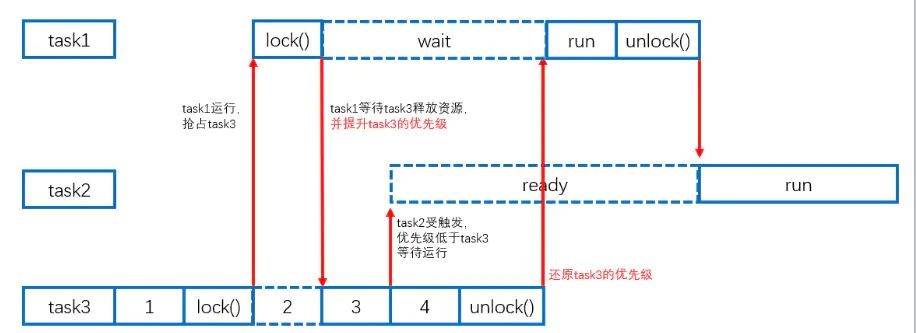

# STM32 FreeRTOS 4_信号量(Semaphore)

## 1. 二值信号量

### 二值信号量的应用
**二值信号量的本质是一个队列长度为 1 的队列 ，该队列就只有空和满两种情况**，这就是二值信号量；

用于**任务同步和中断同步**，也可以实现互斥访问，但**不具有优先级继承**。

- 优先级翻转（二值信号量用于互斥访问）

> 
> 任务优先级：Task1>Task2>Task3。
>
> 1. 开始时Task3获取二值信号量，但是随后Task1进入就绪态使得Task3被抢占。
> 2. Task1试图获取二值信号量，但是由于二值信号量为空，Task1进入阻塞态，Task3继续运行。
> 3. Task2进入就绪态，抢占Task3运行，Task2运行结束后Task3将信号量释放，Task1立刻进入就绪态继续运行。
> 4. 宏观来看，**Task1需要等待Task2运行进入阻塞态后进行执行，任务优先级发生了翻转。**

- 任务和中断同步
> 
>
> 1. 程序开始运行时，信号量无效，因此任务阻塞在这个信号量下。
> 2. 一段时间后，一个中断发生，在中断服务程序中使用API函数`xSemaphoreGiveFromISR()`给出了一个信号，信号量变得有效。
> 3. 当退出中断服务程序后，执行上下文切换，任务解除阻塞，使用API函数`xSemaphoreTake()`取走信号量并执行任务。
> 4. 之后信号量变得无效，任务再次进入阻塞。实现了中断同步。

### API函数(标准API)

#### 创建二值信号量

```c
/**
  * @brief 二值信号量创建函数
  * @retval 二值信号量句柄
  */
SemaphoreHandle_t  xSemaphoreCreateBinary(void);
```

#### 获取信号量

> 不能在中断中试图获取信号量。

```c
/**
  * @brief 信号量获取函数
  */
BaseType_t xSemaphoreTake(SemaphoreHandle_t xSemaphore, TickType_t xTicksToWait)
```

### API函数(CMSIS API)

```C
/**
  * @brief 信号量宏定义
  * @param name 指定名称
  */
#define osSemaphoreDef (name) const osSemaphoreDef_t os_semaphore_def_##name = { 0 }

/**
  * @brief 信号量创建
  * @param semaphore_def：指定osSemaphoreDef宏所定义结构体变量的指针，此时需要用到osSemaphore宏。
  * @param count：指定初始资源数
  * @retval 函数调用成功就返回唯一识别信号量的ID，否者就返回 NULL。
  */
osSemaphoreId osSemaphoreCreate(const osSemaphoreDef_t *semaphore_def, int32_t count);

/**
  * @brief 信号量获取
  * @param semaphore_id：信号量 ID
  * @param millisec：超时设置 0：不管成功与否都立即返回 osWaitForever：如果无法获取资源则休眠，直到获取到资源位置。
  * @retval 返回资源数
  */
int32_t osSemaphoreWait(osSemaphoreId semaphore_id, uint32_t millisec);

/**
  * @brief 信号量释放(可在中断中使用)
  * @param semaphore_id：信号量 ID
  */
osStatus osSemaphoreRelease(osSemaphoreId semaphore_id);
```

## 2. 互斥信号量(Mutex)

### 互斥信号量的应用（互斥锁）

互斥信号量简单说是**具有优先级继承**的**二值**信号量，用于进程中的互斥，**不可用于中断中**。

互斥量必须在任务获取后由该任务解锁。

> 互斥量的运用场合 —— 线程安全：
>
> - 访问外设；
> - 读、修改、写操作导致的问题；
> - 对变量的非原子化访问；
> - 不可重入函数（使用了全局变量的函数）；
>
> **访问共享资源时，必须使用互斥锁。**

- 优先级继承

	> 
	>
	> 1. Task3获得互斥锁；
	> 2. 此时Task1抢占Task3，试图读取资源，由于互斥锁被获取且未被释放，则Task1进入阻塞态并将Task3变为和Task1一致的优先级。
	> 3. Task2进入就绪态，但是由于Task3此时优先级高于Task2，所以Task2无法运行。
	> 4. Task3释放互斥锁，Task1可以读取资源后并释放互斥锁，随后Task2才能运行。
	> 5. Task2和Task1优先级没有发生反转。

	优先级继承只是减少了优先级翻转带来的负面影响，系统的实现不能依赖于优先级继承。

- 死锁

  > Task1 和 Task2 需要得到互斥量 A 和 B。
  >
  > 1. Task1 执行并获得互斥量 A；
  > 2. Task1 执行时被 Task2 抢占；
  > 3. Task2 执行获得互斥量 B，然后试图获取互斥量 A 从而进入阻塞；
  > 4. Task1 执行且试图获取互斥量 B，从而进入阻塞。
  > 5. 死锁开始。Task1 和 Task2 均无法执行。
  
  设计时应当避免死锁。

### API函数(标准API)

```c
/**
  * @brief 互斥信号量创建函数
  * @retval 互斥信号量句柄
  */
SemaphoreHandle_t xSemaphoreCreateMutex(void);
```

### API函数(CMSIS API)

```C
/**
  * @brief 互斥信号量创建函数
  * @param mutex_def 引用由osMutexDef定义的互斥量
  * @retval 互斥信号量句柄
  */
osMutexId osMutexCreate (const osMutexDef_t *mutex_def);

/**
  * @brief 互斥信号量获取函数
  * @param mutex_id 互斥量ID
  * @param 等待信号量可用的最大超时时间，单位为系统节拍周期。
  */
osStatus osMutexWait (osMutexId mutex_id, uint32_t millisec);

/**
  * @brief 互斥信号量释放函数
  * @param mutex_id 互斥量ID
  */
osStatus osMutexRelease (osMutexId mutex_id);
```

## 3. 递归互斥锁(Recursive Mutexes)

> 为了避免自我死锁的问题：
>
> - 任务获得了互斥锁；
> - 它调用一个库函数；
> - 库函数要去获取同一个互斥锁，于是它阻塞：任务A休眠，等待任务A来释放互斥锁；
> - 死锁发生。
>
> 使用递归互斥锁。

一个任务可以多次获得递归互斥锁，如果获取n次，释放时必须释放n次。

## 4. 计数信号量

### 计数信号量的应用

计数型信号量相当于队列长度大于 1 的队列，因此计数型信号量能够容纳多个资源，这在计数型信号量被创建的时候确定的。

> 二值信号量可以用于中断同步，但是中断发生过于频繁时，如果任务处理时间很长，可能会导致中断丢失，此时可以使用计数信号量。

1. **事件计数**

当每次事件发生后，在事件处理函数中释放计数型信号量（计数值+1），其他任务
会获取计数型信号量（计数值-1） ，这种场合一般在创建时将初始计数值设置为 0;

2. **资源管理**

信号量表示有效的资源数目。任务必须先获取信号量（信号量计数值-1 ）才能获取资源控制权。当计数值减为零时表示没有的资源。当任务使用完资源后，必须释放信号量（信号量计数值+1）。信号量创建时计数值应等于最大资源数目。

### API函数(标准API)

```c
/**
  * @brief 计数信号量创建函数
  * @param uxMaxCount 最大值
  * @param uxInitialCount 初始值
  * @retval 计数信号量句柄
  */
SemaphoreHandle_t xSemaphoreCreateCounting (UBaseType_t uxMaxCount,UBaseType_t uxInitialCount);

/**
  * @brief 计数信号量计数函数
  * @param xSemaphore 计数信号量句柄
  */
UBaseType_t uxSemaphoreGetCount(SemaphoreHandle_t xSemaphore);
```

