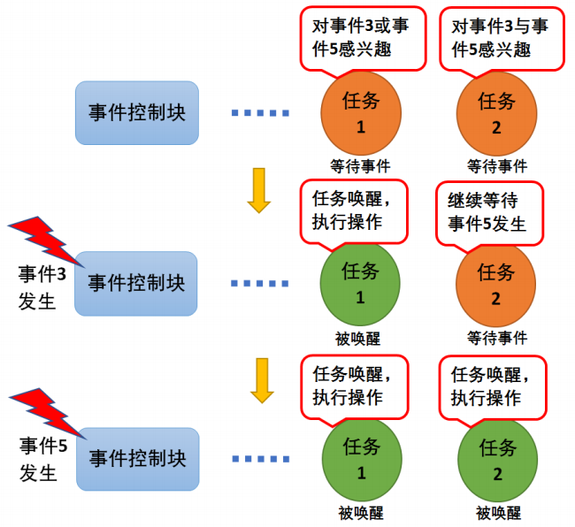

# STM32 FreeRTOS 5_事件标志组(EventGroup)

## 1. 事件标志组

**事件标志位**：用一个位，来表示事件是否发生。

**事件标志组**是一组事件标志位的集合，通常用一个整型的各个位表示事件状态。

> 1. 事件是一种实现任务间通信的机制，主要用于**实现多任务间的同步**，但事件通信只能是事件类型的通信，**无数据传输**。 
> 2. 与信号量不同的是，它可以实现一对多，多对多的同步。即一个任务可以等待多个事件的发生：可以是任意一个事件发生时唤醒任务进行事件处理；也可以是几个事件都发生后才唤醒任务进行事件处理。同样，也可以是多个任务同步多个事件。
> 3. **事件逻辑**：事件的“逻辑或”也被称作是独立型同步，指的是任务感兴趣的所有事件任一件发生即可被唤醒；事件“逻辑与”则被称为是关联型同步，指的是任务感兴趣的若干事件都发生时才被唤醒，并且事件发生的时间可以不同步。
> 4. 事件只与任务相关联，事件相互独立，一个 32 位的事件集合（EventBits_t 类型的变量，实际可用与表示事件的只有 24 位），用于标识该任务发生的事件类型，其中每一位表示一种事件类型（0 表示该事件类型未发生、1 表示该事件类型已经发生），一共 24 种事件类型。



## 2. API函数(标准API)

### 事件标志组的创建

```c
/**
  *	@brief 事件标志组创建函数
  * @retval 返回事件标志组的句柄
  */
EventGroupHandle_t xEventGroupCreate(void);
```

### 事件标志位的设置

```c
/**
  *	@brief 将指定的事件位清零
  * @param xEventGroup 事件标志位句柄
  * @param uxBitsToClear 清零的事件标志位（宏定义）
  */
EventBits_t xEventGroupClearBits(EventGroupHandle_t xEventGroup,const EventBits_t uxBitsToClear);

/**
  *	@brief 将指定的事件位置1
  * @param xEventGroup 事件标志位句柄
  * @param uxBitsToSet 置1的事件标志位
  */
EventBits_t xEventGroupSetBits(EventGroupHandle_t xEventGroup,const EventBits_t uxBitsToSet);
```

### 事件标志位的读取和等待

```c
/**
  *	@brief 获取事件标志组的值
  * @param xEventGroup 事件标志位句柄
  */
EventBits_t xEventGroupGetBits(EventGroupHandle_t xEventGroup);

/**
  *	@brief 等待指定标志位函数
  * @param xEventGroup 事件标志位句柄
  * @param uxBitsToWaitFor 要等待的事件位，使用按位或进行合并
  * @param xClearOnExit 函数退出后是否将标志组清零
  * @param xWaitForAllBits 事件逻辑
  * @param xTicksToWait 超时时间
  */
EventBits_t xEventGroupWaitBits(EventGroupHandle_t xEventGroup,const EventBits_t uxBitsToWaitFor,const BaseType_t xClearOnExit,const BaseType_t xWaitForAllBits,TickType_t xTicksToWait);
```

## 3. API函数(CMSIS API)

（只能使用CMSIS V2版本）

### 事件标志组的创建

```c
/**
  *	@brief 事件标志组创建函数
  * @param attr 引用由osEventFlagsAttr_t定义的事件属性
  * @retval 返回事件标志组的句柄
  */
osEventFlagsId_t osEventFlagsNew (const osEventFlagsAttr_t *attr);
```

### 事件标志位的设置

```c
/**
  *	@brief 事件标志组创建函数
  * @param ef_id 事件组ID
  * @param flags 指定事件中的事件标志位。
  */
uint32_t osEventFlagsSet (osEventFlagsId_t ef_id, uint32_t flags);

/**
  *	@brief 将指定的事件位清零
  * @param ef_id 事件组ID
  * @param flags 指定事件中的事件标志位。
  */
uint32_t osEventFlagsClear (osEventFlagsId_t ef_id, uint32_t flags)
```

### 事件标志位的读取和等待

```c
/**
  *	@brief 等待指定标志位函数
  * @param ef_id 事件组ID
  * @param flags 指定事件中的事件标志位。
  * @param options osFlagsNoClear 是否清除flags指定的事件标志位，osFlagsWaitAll 是否等待flags指定的位都置位的时候才满足任务唤醒的条件
  * @param timeout 最大超时时间，单位为系统节拍周期
  */
uint32_t osEventFlagsWait (osEventFlagsId_t ef_id, uint32_t flags, uint32_t options, uint32_t timeout);
```

