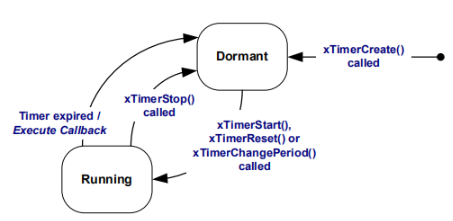
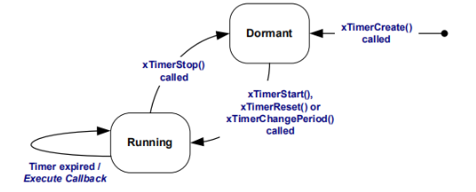
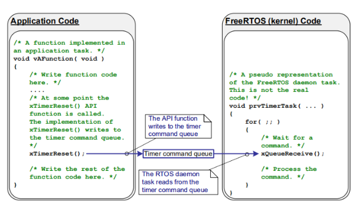
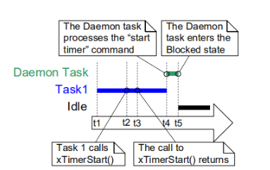
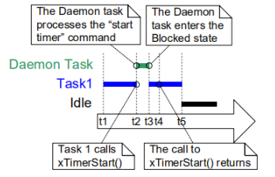

# STM32 FreeRTOS 6_软件定时器

## 1. 软件定时器

### 定时器

**定时器**：从指定的时刻开始，经过一个指定时间，然后触发一个超时事件，用户可自定义定时器的周期；

**硬件定时器**：芯片本身自带的定时器模块，硬件定时器的精度一般很高，每次在定时时间到达之后就会自动触发一个中断，用户在中断服务函数中处理信息。

**软件定时器**：是指具有定时功能的软件，可设置定时周期，**当指定时间到达后要调用回调函数（也称超时函数）**，用户在回调函数中处理信息。

> - 硬件定时器数量有限，而软件定时器理论上只需有足够内存，就可以创建多个；
> - 软件定时器相对硬件定时器来说，精度没有那么高（因为它以系统时钟为基准，系统时钟中断优先级又是最低，容易被打断）。 对于需要高精度要求的场合，不建议使用软件定时器。

### FreeRTOS 的软件定时器

- 软件定时器特性：

	1. 可裁剪，如果要使能软件定时器，需将`configUSE_TIMERS`配置项配置成 1；
	2. 软件定时器支持设置成：**单次定时器或周期定时器**；
	3. 软件定时器的超时回调函数是由软件定时器服务任务调用的，软件定时器的超时回调函数本身不是任务，因此**不能在该回调函数中使用可能会导致任务阻塞的 API 函数**。

- 软件定时器的服务任务：

	在调用函数`vTaskStartScheduler()`开启任务调度器的时候，会创建一个用于管理软件定时器的任务，这个任务就叫做守护任务；

	1. 负责软件定时器超时的逻辑判断
	2. 调用超时软件定时器的超时回调函数 
	3. 处理软件定时器命令队列 

- 软件定时器的状态

	1. **休眠态**：软件定时器可以通过其句柄被引用，但因为没有运行，所以其定时超时回调函数不会被执行；
	2. **运行态**：运行态的定时器，当指定时间到达之后，它的超时回调函数会被调用；
	3. 新创建的软件定时器处于休眠状态；
	4. 发送命令队列让软件定时器从休眠态转变为运行态；

- 软件定时器种类

	1. **单次定时器**：单次定时器的一旦定时超时，只会执行一次其软件定时器超时回调函数，不会自动重新开启定时，不过可以被手动重新开启。

     
	
	2. **周期定时器**：周期定时器的一旦启动以后就会在执行完回调函数以后自动的重新启动 ，从而周期地执行其软件定时器回调函数。
	
	   
	

### 守护任务

FreeRTOS 不会在 `tick` 中断内执行软件定时器函数（在Tick中断中判断定时器是否超时，如果超时了，调用它的回调函数）；而会创建守护任务 `RTOS Damemon Task`。编写的任务函数要使用定时器时，是通过定时器命令队列`timer command queue` 和守护任务交互。



> 守护任务的优先级为`configTIMER_TASK_PRIORITY`；定时器命令队列的长度为`configTIMER_QUEUE_LENGTH`。

守护任务的工作包括：**从命令队列里取出命令、处理；执行定时器的回调函数。**其中能否及时处理定时器的命令、能否及时执行定时器的回调函数，严重依赖于守护任务的优先级。

> - 守护任务的优先性级较低
>
>   - $t_1$：Task1处于运行态，守护任务处于阻塞态。守护任务在这两种情况下会退出阻塞态切换为就绪态：**命令队列中有数据、某个定时器超时了**。至于守护任务能否马上执行，取决于它的优先级。
>   - $t_2$：Task1调用`xTimerStart()`，`xTimerStart()`只是把启动定时器的命令发给定时器命令队列，使得守护任务退出阻塞态。Task1的优先级高于守护任务，所以守护任务无法抢占Task1。
>   - $t_3$：Task1执行完`xTimerStart()`，但是定时器的启动工作由守护任务来实现，所以`xTimerStart()`返回并不表示定时器已经被启动了。
>   - $t_4$：Task1由于某些原因进入阻塞态，现在轮到守护任务运行。守护任务从队列中取出启动定时器命令，启动定时器。
>   - $t_5$：守护任务处理完队列中所有的命令，再次进入阻塞态。
>
>   
>
> - 守护任务的优先性级较高
>
>   - $t_1$：Task1处于运行态，守护任务处于阻塞态。
>     守护任务在这两种情况下会退出阻塞态切换为就绪态：命令队列中有数据、某个定时器超时了。
>     至于守护任务能否马上执行，取决于它的优先级。
>   - $t_2$：Task1调用`xTimerStart()`，`xTimerStart()`只是把启动定时器的命令发给定时器命令队列，使得守护任务退出阻塞态。守护任务的优先级高于Task1，所以守护任务抢占Task1，守护任务开始处理命令队列。Task1在执行`xTimerStart()`的过程中被抢占，这时它无法完成此函数。
>   - $t_3$：守护任务处理完命令队列中所有的命令，再次进入阻塞态。此时Task1是优先级最高的就绪态任务，它开始执行。
>   - $t_4$：Task1之前被守护任务抢占，对`xTimerStart()`的调用尚未返回。现在开始继续运行次函数、返回。
>   - $t_5$：Task1由于某些原因进入阻塞态。
>
>   
>
> - 定时器的超时时间是基于调用`xTimerStart()`的时刻，而不是基于守护任务处理命令的时刻。

## 2. 软件定时器的API函数（CMSIS API）

```c
/**
  * @brief 软件定时器句柄定义
  * @param name 软件定时器名
  * @param function 回调函数名
  */
#define osTimerDef(name, function)  \
const osTimerDef_t os_timer_def_##name = \
{ (function), NULL }

/**
  * @brief 软件定时器创建
  * @param timer_def 引用由osTimerDef定义的定时器
  * @param type 设置为 osTimerPeriodic，那么软件定时器的工作模式就是周期模式， 一直会以用户指定的 xTimerPeriod 周期去执行回调函数。如果设置为 osTimerOnce，那么软件定时器就在用户指定的 xTimerPeriod 周期下运行一次后就进入休眠态。
  * @param argument 回调函数传入形参
  */
osTimerId osTimerCreate (const osTimerDef_t *timer_def, os_timer_type type, void *argument);

/**
  * @brief 启动软件定时器
  * @param timer_id 定时器ID
  * @param millisec 用户指定的超时时间，单位为系统节拍周期(即 tick)
  */
osStatus osTimerStart (osTimerId timer_id, uint32_t millisec);

/**
  * @brief 停止一个软件定时器，让其进入休眠态。
  * @param timer_def 引用由osTimerDef定义的定时器
  */
osStatus osTimerStop (osTimerId timer_id);

/**
  * @brief 用于删除一个已经被创建成功的软件定时器，删除之后就无法使用该定时器，并且定时器相应的资源也会被系统回收释放。
  * @param timer_def 引用由osTimerDef定义的定时器
  */
osStatus osTimerDelete (osTimerId timer_id)
```

