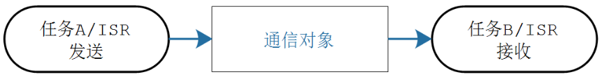
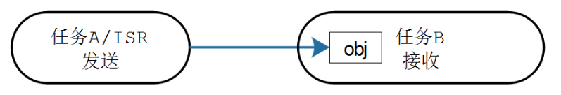

# STM32 FreeRTOS 9_任务通知(Signal)

## 1. 任务通知(信号)

### 任务通知

使用队列、信号量、事件组等等方法时，并不知道方法的来源。使用任务通知时，可以明确指定通知哪个任务。使用队列、信号量、事件组时，要事先创建对应的结构体，双方通过中间的结构体通信；使用任务通知时，任务结构体`TCB`中就包含了内部对象，可以直接接收别人发过来的通知。





任务通知比队列，信号量和事件组的效率更高，内存占用更小。

任务通知存在限制：不能发送数据给ISR，数据只能给该任务独享，无法缓冲数据，无法广播给多个任务，如果发送受阻，发送方无法进入阻塞状态等待。

每个任务都有一个结构体`TCB`，一个用于表示通知状态的成员，一个用于表示通知值的成员。

### 信号API函数（标准API）

```c
/**
  * @brief 向其他任务发送通知，使得通知值加一，使得通知状态变为taskNOTIFICATION_RECEIVED
  * @param xTaskToNotify 		任务句柄(创建任务时得到)，给哪个任务发通知
  */
BaseType_t xTaskNotifyGive( TaskHandle_t xTaskToNotify );

/**
  * @brief 向其他任务发送通知，使得通知值加一，使得通知状态变为taskNOTIFICATION_RECEIVED(中断中使用)
  * @param pxHigherPriorityTaskWoken 被通知的任务，可能正处于阻塞状态。此函数发出通知后，会把它从阻塞状态切换为就绪态。如果被唤醒的任务的优先级，高于当前任务的优先级，则*pxHigherPriorityTaskWoken被设置为pdTRUE，表示在中断返回之前要进行任务切换。
  */
void vTaskNotifyGiveFromISR( TaskHandle_t xTaskHandle, BaseType_t *pxHigherPriorityTaskWoken );

/**
  * @brief	取出通知值，如果通知值等于0，则阻塞(可以指定超时时间);当通知值大于0时，任务从阻塞态进入就绪态，返回前把通知值减一，或者把通知值清零
  * @param xClearCountOnExit 	函数返回前是否清零；pdTRUE：把通知值清零；pdFALSE：如果通知值大于0，则把通知值减一。
  * @param xTicksToWait 		任务进入阻塞态的超时时间，它在等待通知值大于0。
  * @return 函数返回之前，在清零或减一之前的通知值。
  */
uint32_t ulTaskNotifyTake( BaseType_t xClearCountOnExit, TickType_t xTicksToWait );

/**
  * @brief 向其他任务发送通知，
  * @param xTaskToNotify 		任务句柄(创建任务时得到)，给哪个任务发通知
  * @param ulValue
  * @param eNotifyAction
  			eNoAction					仅仅是更新通知状态为pending，未使用ulValue。这个选项相当于轻量级的、更高效的二进制信号量。
  			eSetBits					通知值 = 原来的通知值 | ulValue，按位或。相当于轻量级的、更高效的事件组。
  			eIncrement					通知值 = 原来的通知值 + 1，未使用ulValue。相当于轻量级的、更高效的二值信号量/计数型信号量。
			eSetValueWithoutOverwrite	不覆盖。如果通知状态为pending(表示有数据未读)，则此次调用xTaskNotify不做任何事，返回pdFAIL。如果通知状态不是pending(表示没有新数据)，则通知值 = ulValue。
			eSetValueWithOverwrite		覆盖。无论如何，不管通知状态是否为pendng，通知值 = ulValue。
  			
  */
BaseType_t xTaskNotify( TaskHandle_t xTaskToNotify, uint32_t ulValue, eNotifyAction eAction );

/**
  * @brief 向其他任务发送通知(中断中使用)
  * @param pxHigherPriorityTaskWoken 
  * @param ulValue
  * @param eNotifyAction  
  */
BaseType_t xTaskNotifyFromISR( TaskHandle_t xTaskToNotify,
                               uint32_t ulValue, 
                               eNotifyAction eAction, 
                               BaseType_t *pxHigherPriorityTaskWoken );

/**
  * @brief	取出通知值
  * @param ulBitsToClearOnEntry	在xTaskNotifyWait入口处，要清除通知值的哪些位，通知状态不是pending的情况下，才会清除
  * @param ulBitsToClearOnExit	在xTaskNotifyWait出口处，如果不是因为超时推出，而是因为得到了数据而退出时：通知值 = 通知值 & ~(ulBitsToClearOnExit)。
  * @param pulNotificationValue 用来取出通知值。在函数退出时，使用ulBitsToClearOnExit清除之前，把通知值赋给*pulNotificationValue。
  * @param xTicksToWait 		
  * @return 是否收到通知
  */
BaseType_t xTaskNotifyWait( uint32_t ulBitsToClearOnEntry, 
                            uint32_t ulBitsToClearOnExit, 
                            uint32_t *pulNotificationValue, 
                            TickType_t xTicksToWait );

```

### 信号API函数（CMSIS API）

CMSIS中，信号类似于事件标志组，向指定线程发送一个整型数。范围为`0~0x80000000`。其中，`0x80000000`作为错误信号。

```c
/**
  * @brief 信号发送函数(自动识别是否位于中断中)
  * @param thread_id 线程ID
  * @param signal 信号整型数
  */
int32_t osSignalSet(osThreadId thread_id,int32_t signal);

/**
  * @brief 信号接收函数
  * @param signals 指定信号数
  * @param millisec 超时时间
  */
osEvent osSignalWait(int32_t signals, uint32_t millisec);
```

